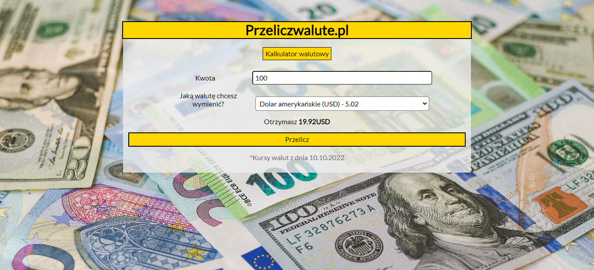

# Currnecy-converter

## What currencies
This is website to convert currencies from PLN to GBP, USD, EUR or CHF.
## Used technologies
I used: BEM convention, JS, CSS, ES6+.
## Intructions
You have to put amount what you want to exchange to first field and what currency you want to get.
Press "Przelicz" and then you find out how much you can get.
